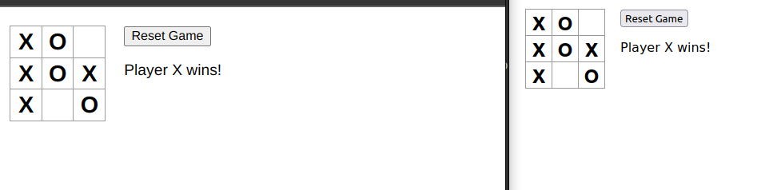

# Tic Tac Toe Multiplayer Game

This project implements a multiplayer Tic Tac Toe game using React for the frontend and Node.js with Socket.io for the backend. Players can join the game, make moves, and the game state is synchronized in real-time between all connected clients.

## Features

- **Real-time Gameplay**: Updates are instantly reflected across all clients using WebSocket communication.
- **Turn-based Gameplay**: Players take turns to make moves. Only one player can move at a time.
- **Winning Condition**: The game automatically detects when a player has won and declares the winner.
- **Reset Game**: Players can reset the game board to start a new game.

## Technologies Used

- **Frontend**: React.js
- **Backend**: Node.js, Express.js
- **Real-time Communication**: Socket.io
- **Styling**: Basic CSS

## Setup Instructions

### Prerequisites# Tic Tac Toe Multiplayer Game

This project implements a multiplayer Tic Tac Toe game using React for the frontend and Node.js with Socket.io for the backend. Players can join the game, make moves, and the game state is synchronized in real-time between all connected clients.

## Features

- **Real-time Gameplay**: Updates are instantly reflected across all clients using WebSocket communication.
- **Turn-based Gameplay**: Players take turns to make moves. Only one player can move at a time.
- **Winning Condition**: The game automatically detects when a player has won and declares the winner.
- **Reset Game**: Players can reset the game board to start a new game.

## Technologies Used

- **Frontend**: React.js
- **Backend**: Node.js, Express.js
- **Real-time Communication**: Socket.io
- **Styling**: Basic CSS

## Setup Instructions

### Prerequisites

- Node.js installed on your local machine
- npm (Node Package Manager) or yarn

### Run Locally

1. Clone the repository:

   ```bash
   git clone https://github.com/ArunRawat404/Tic-Tac-Toe-Multiplayer
   ```

- Node.js installed on your local machine
- npm (Node Package Manager) or yarn

2. Run both frontend and backend server
   ```
   npm install
   npm start
   ```

### Screenshot


